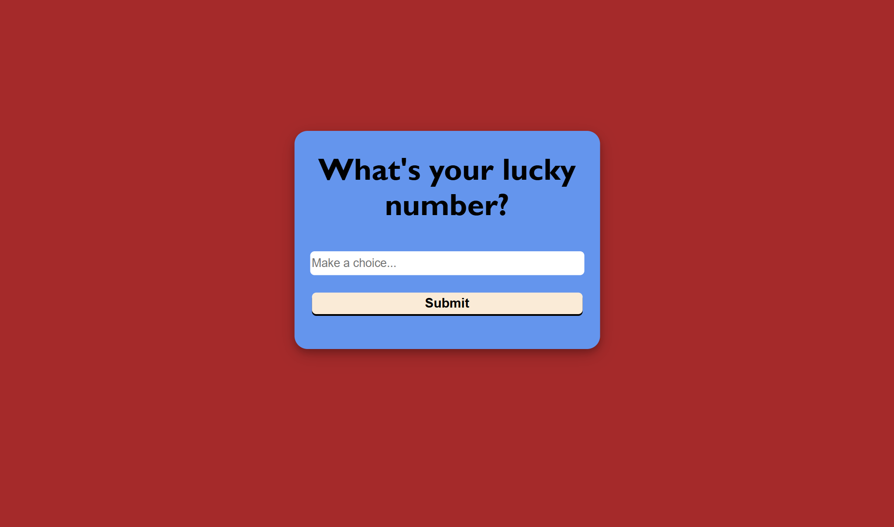
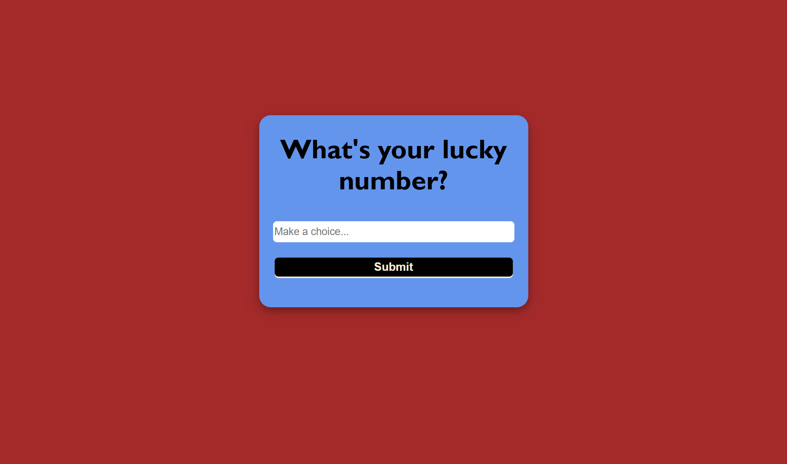
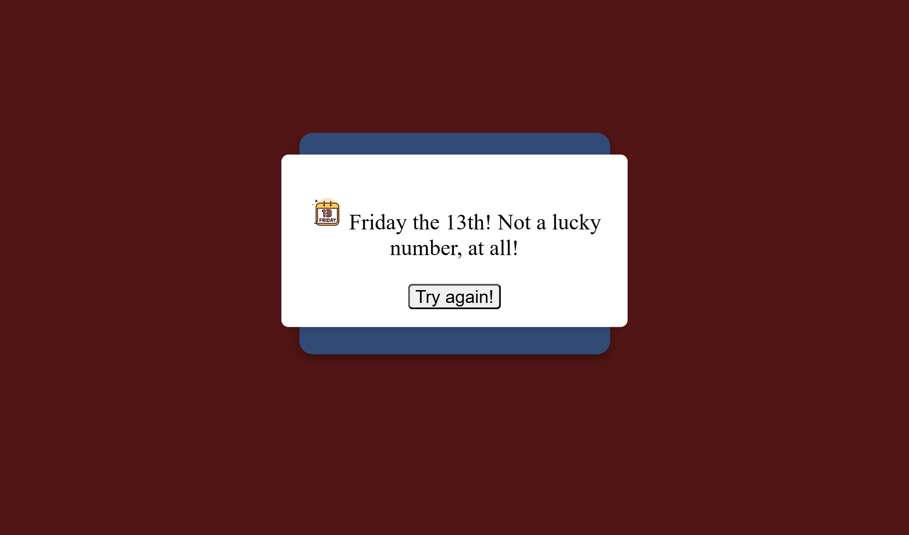
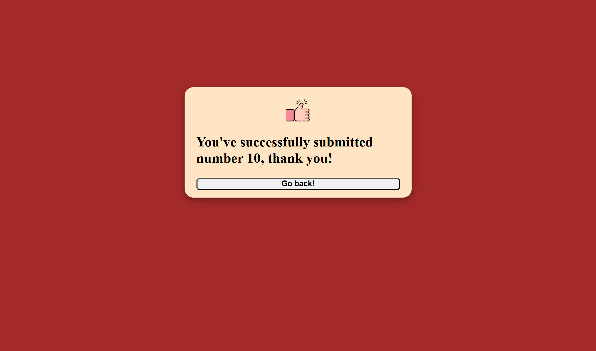
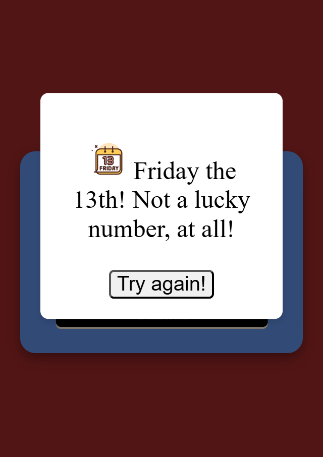
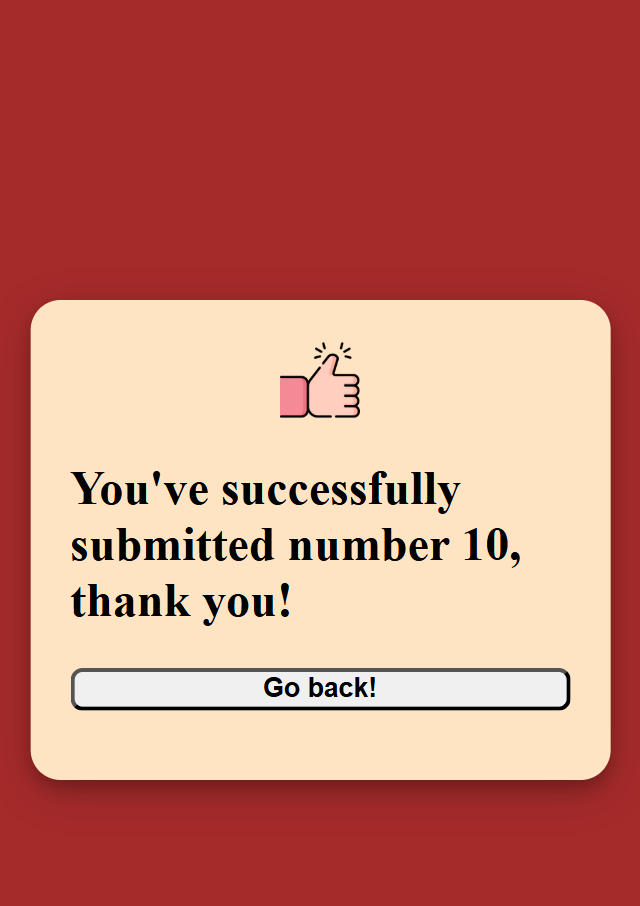

# Solo project for Voyage - What's your lucky number?

This is a solo project for Voyage 53 of Chingu.

## Table of contents

- [The challenge](#the-challenge)
- [Screenshots](#screenshots)
- [Built with](#built-with)
- [Links](#links)

### The challenge

Users should be able to:

- Test the input of a simple submit type form. If the input given by the user is not 13, it's accepted, otherwise it's not. The users get notified with a message from a pop-up window if it's not accepted. Otherwise, they get transferred to a screen notifying them of their successful submission, giving them the choice to go back and try a different number. 
- Experience this app in both mobile and desktop design.

### Screenshots

Desktop-Tablet design

Mobile S-M-L design

### Built with

- Semantic HTML5 markup
- CSS custom properties
- Flexbox
- Mobile-first workflow

### Links

- Solution URL: [https://github.com/johnsavvidis/Solo-project-for-Voyage]
- Live Site URL: [https://johnsavvidis.github.io/Solo-project-for-Voyage/]